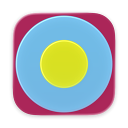

<p align="center">
  
</p>

<h1 align="center">Tonk</h1>

<p align="center">
  A native macOS workspace for Tonk spaces and agents.
</p>

## Build

Requires macOS 15+ and full Xcode 26+.

```sh
# With Nix
nix develop
dev:run

# Without Nix
bash scripts/build-app.sh
open .build/Tonk.app
```

Run `dev:help` for build, install, and test commands.

## Use

Sign in to Tonk, open a space, and click **New chat**. Choose your model provider
in **Settings…**.

ChatGPT sign-in requires the [Codex CLI](https://learn.chatgpt.com/docs/cli).
Claude subscription access requires [Claude Code](https://code.claude.com/docs/en/setup).

Chats and drafts stay on your Mac. Messages go to your selected provider;
API keys are stored in macOS Keychain.
